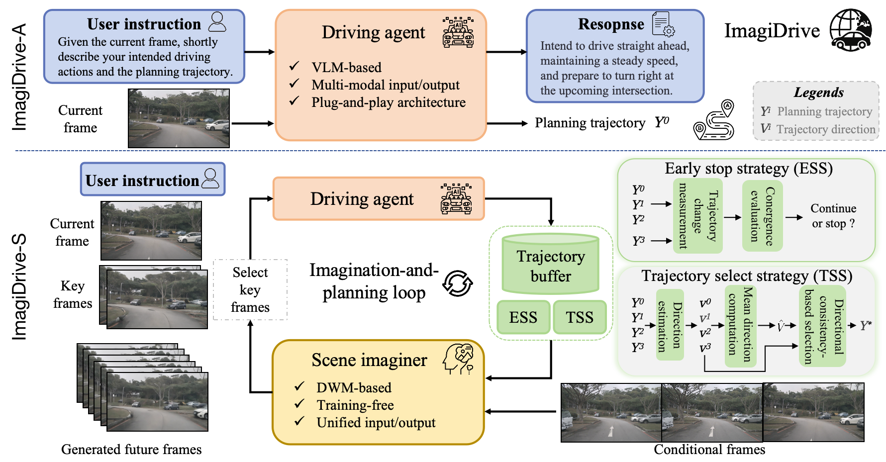

# ImagiDrive: A Unified Imagination-and-Planning Framework for Autonomous Driving


[**\[Paper\]**](https://arxiv.org/pdf/2508.11428)  

[ImagiDrive: A Unified Imagination-and-Planning Framework for Autonomous Driving](https://arxiv.org/pdf/2508.11428) 

**Jingyu Li**, **Bozhou Zhang**, **Xin Jin**, **Jiankang Deng**, **Xiatian Zhu**, **Li Zhang**

<span style="color:gray">arXiv 2025</span>


## Abstract
Autonomous driving requires rich contextual comprehension and precise predictive reasoning to navigate dynamic and complex environments safely. Vision-Language Models (VLMs) and Driving World Models (DWMs) have independently emerged as powerful recipes addressing different aspects of this challenge. VLMs provide interpretability and robust action prediction through their ability to understand multi-modal context, while DWMs excel in generating detailed and plausible future driving scenarios essential for proactive planning. Integrating VLMs with DWMs is an intuitive, promising, yetunderstudied strategy to exploit the complementary strengths of accurate behavioral prediction and realistic scene generation. Nevertheless, this integration presents notable challenges, particularly in effectively connecting action-level decisions with high-fidelity pixel-level predictions and maintaining computational efficiency. In this paper, we propose ImagiDrive, a novel end-to-end autonomous driving framework that integrates a VLM-based driving agent with a DWM-based scene imaginer to form a unified imagination-and-planning loop. The driving agent predicts initial driving trajectories based on multi-modal inputs, guiding the scene imaginer to generate corresponding future scenarios. These imagined scenarios are subsequently utilized to iteratively refine the driving agent’s planning decisions. To address efficiency and predictive accuracy challenges inherent in this integration, we introduce an early stopping mechanism and a trajectory selection strategy. Extensive experimental validation on the nuScenes and NAVSIM datasets demonstrates the robustness and superiority of ImagiDrive over previous alternatives under both open-loop and closed-loop conditions. 

## Pipeline


## News
2025.08, the paper is released on arXiv, and the code will be made publicly available upon acceptance.

## 📖 Citation

If you find our work useful, please cite:

```bibtex
@article{li2025imagidrive,
  title={ImagiDrive: A Unified Imagination-and-Planning Framework for Autonomous Driving}, 
  author={Jingyu Li and Bozhou Zhang and Xin Jin and Jiankang Deng and Xiatian Zhu and Li Zhang}
  journal={arXiv preprint},
  year={2025}
}
